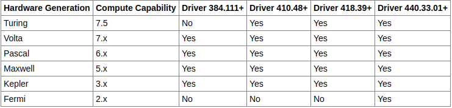
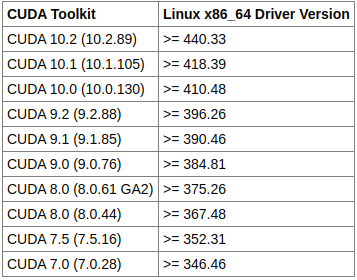
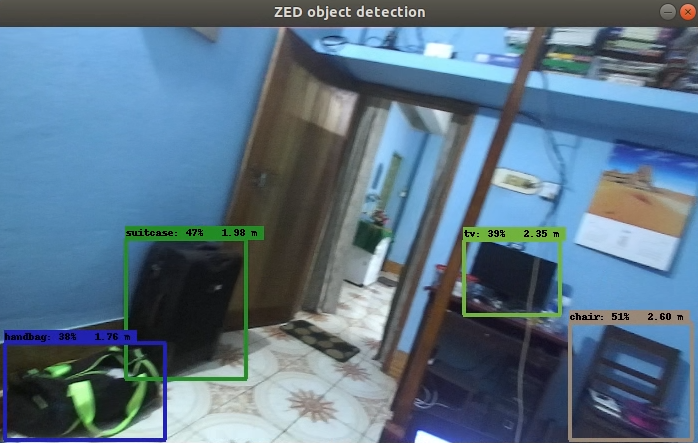

# Nvidia-Graphics-Driver-CUDA-&-CUDNN-Installation
It's a must installation after a fresh Ubuntu 18.04 OS installation
## OS Installation Guideline:
- Download Ubuntu 18.04 OS image from this website: https://ubuntu.com/download/desktop
- Download Etherbalena from this website: https://www.balena.io/etcher/
- Follow this tutorial for installing Ubuntu 18.04 LTS OS on your system: https://www.youtube.com/watch?v=G6LAIrGeIjo
## Configuring Latest Python Version:
Ubuntu 18.04 LTS comes with preinstalled python 3. To check, run on terminal:
```
python3 --version
```
It should show: 3.6.9. Now to make python 3.6.9 default & import it with just "python" command using symbolic link, run on terminal:
```
sudo ln -s /usr/bin/python3 /usr/bin/python
```
Check with the following command: 
```
python --version
```
**Note**: 
- Don't try to undo python symbolic link step by reversing the order, otherwise the system will break & you will loose your terminal. 
- If you want to unlink the symbolic link we created, type:
```
sudo unlink usr/bin/python3
```
## Configuring Latest PIP Version:
If you want to use pip (python installation pipeline), you have to install it. You can install it with python 3. Run in a terminal:
```
sudo apt install python3-pip
```
To verify installation, please run: 
```
pip3 --version
```
It should show: pip 9.0.1. If you want to upgrade pip3 (To install tensorflow 2.x later), run: 
```
pip3 install --upgrade pip
``` 
If you want to import pip3 as pip, run the following command:
```
sudo ln -s /usr/bin/pip3 /usr/bin/pip
```
Now check it with the following command: 
```
pip --version
```
It should show: pip 20.0.2 or something similar.
**Note**: 
- Don't try to undo pip symbolic link step by reversing the order, otherwise the system will break & you can seriously damage your system. 
- If you want to unlink the symbolic link we created, type:
```
sudo unlink usr/bin/pip3
```
## Configuring Latest CMake Version:
Ubuntu 18.04 LTS doesn't come with a preinstalled cmake. To check, run on terminal:
```
cmake --version
```
It should show: Not installed but can be installed with "sudo apt-get install cmake". Run the following command in the terminal:
```
sudo mkdir /opt/cmake
```
Manually download "cmake-3.17.0-Linux-x86_64.sh" file to the "Downloads" directory from this site: https://cmake.org/download/. Run the following command to copy the file to newly created cmake directory: 
```
sudo cp ~/Downloads/cmake-3.17.0-Linux-x86_64.sh /opt/cmake/
```
Now run the following command to install cmake: <br>
```
cd /opt/cmake
sudo sh cmake-3.17.0-Linux-x86_64.sh --prefix=/opt/cmake --skip-license
```
Follow the command prompt for further installation instruction. Now to import current version of cmake using symbolic link, type:
```
sudo ln -s /opt/cmake/bin/cmake /usr/local/bin/cmake
```
Remove installation file, it's no longer needed:
```
rm cmake-3.17.0-Linux-x86_64.sh
```
Check with the following command: 
```
cmake --version
```
It should show: 3.17.0
## Configuring Latest Nvidia Graphics Driver:
A list of Nvidia Graphics Driver with supported compute architecture is given below:
<p align="center">
    
</p>

Go to Activities Overview--->Software Updater--->Settings--->Additional Driver & Choose available latest nvidia driver. Then click on "Apply changes".
If you want to check for recent version of nvidia gpu driver, please type:
```
apt search nvidia-driver
```
If you want more updated version of nvidia gpu driver, run:
```
sudo apt-add-repository ppa:graphics-drivers/ppa
sudo apt-get update
sudo apt-get install nvidia-driver-440
```
Restart the computer. Check the version of the nvidia graphics driver:
```
nvidia-smi
```
It should show: driver version-440.33 & CUDA version-10.2
## Configuring Latest CUDA installation:
A list of Nvidia Graphics Driver with supported cuda version is given below:
<p align="center">
    
</p>

Check whether cuda is already installed on your system or not. In the terminal, run:
```
nvcc --version
```
It should show: nvcc not installed but can be installed by sudo apt install nvidia-cuda-toolkit. Go to this website: https://developer.nvidia.com/cuda-downloads. Then click on Linux--->x86_64--->Ubuntu--->18.04--->deb local, you will get the installation file & proccedure. <br>
The installation proccedure is also mentioned below. Run the following commands in the terminal:
```
wget https://developer.download.nvidia.com/compute/cuda/repos/ubuntu1804/x86_64/cuda-ubuntu1804.pin
sudo mv cuda-ubuntu1804.pin /etc/apt/preferences.d/cuda-repository-pin-600
wget http://developer.download.nvidia.com/compute/cuda/10.2/Prod/local_installers/cuda-repo-ubuntu1804-10-2-local-10.2.89-440.33.01_1.0-1_amd64.deb
sudo dpkg -i cuda-repo-ubuntu1804-10-2-local-10.2.89-440.33.01_1.0-1_amd64.deb
sudo apt-key add /var/cuda-repo-10-2-local-10.2.89-440.33.01/7fa2af80.pub
sudo apt-get update
sudo apt-get -y install cuda
```
Now there are some post installation instructions. You can get documentation of post installation instruction here: https://docs.nvidia.com/cuda/cuda-installation-guide-linux/index.html#post-installation-actions. <br>
Post installation proccedure is also documented below. Just add 2 lines to your .bashrc file & save it.
```
export PATH=/usr/local/cuda-10.2/bin:/usr/local/cuda-10.2/NsightCompute-2019.5${PATH:+:${PATH}}
export LD_LIBRARY_PATH=/usr/local/cuda-10.2/lib64\ ${LD_LIBRARY_PATH:+:${LD_LIBRARY_PATH}}
```
To check the installation, open a new terminal & run:
```
nvcc --version
``` 
**Note**:
- It's necessary to double check Nvidia Graphics driver supported cuda version. Otherwise, we won't be able to use matching version of tensorflow later in this tutorial.  
- If you want to know what does ${PATH:+:${PATH}} mean & how does it work, visit this website: https://unix.stackexchange.com/questions/267506/what-does-pathpath-mean.
- $LD_LIBRARY_PATH points to the directory where cuda & cudnn dynamic libraries (dll) are loaded. These libraries are necessary while running tensorflow in order to use your GPU. 
## Configuring Latest CUDNN installation:
First check that you have already cudnn installed on your system or not. Run:
```
cat /usr/local/cuda/include/cudnn.h | grep CUDNN_MAJOR -A 2
```
Or,
```
cat /usr/include/cudnn.h | grep CUDNN_MAJOR -A 2
```
It should show: No such file or directory. Follow the installation guideline documented on this website: https://docs.nvidia.com/deeplearning/sdk/cudnn-install/index.html <br>
Installation proccedure is also documented below. Go to this website: https://developer.nvidia.com/rdp/cudnn-download & download "cuDNN Library for Linux". Put it to your home directory after download. Now open a new terminal & run the following command:
 ```
 tar -xzvf cudnn-10.2-linux-x64-v7.6.5.32.tgz
 sudo cp cuda/include/cudnn.h /usr/local/cuda/include
 sudo cp cuda/lib64/libcudnn* /usr/local/cuda/lib64
 sudo chmod a+r /usr/local/cuda/include/cudnn.h /usr/local/cuda/lib64/libcudnn*
 ```
To check the installation, run the following command:
```
cat /usr/local/cuda/include/cudnn.h | grep CUDNN_MAJOR -A 2
```
It should show: #define CUDNN_MAJOR 7 #define CUDNN_MINOR 6 #define CUDNN_PATCHLEVEL 5. Then in the same terminal, run: 
```
sudo ldconfig
```
**Note**: 
- If you get the error: /sbin/ldconfig.real: /usr/local/cuda-10.2/targets/x86_64-linux/lib/libcudnn.so.7 is not a symbolic link, then follow the instruction below. If you don't get the error message, your installation is complete & you don't need to continue further. Otherwise, run the following command: 
 ```
 cd /usr/local/cuda/lib64/
 ls -lha libcudnn*
 ```
- You should see two symlinks (bold teal) and one single file. Something like this:
 ```
 /usr/local/cuda/lib64$ ls -lha libcudnn*
lrwxrwxrwx 1 root root  13 Mar 25 23:56 libcudnn.so -> libcudnn.so.7
lrwxrwxrwx 1 root root  17 Mar 25 23:55 libcudnn.so.7 -> libcudnn.so.7.6.5
-rwxr-xr-x 1 root root 76M Mar 25 23:27 libcudnn.so.7.6.5
```
- If libcudnn.so and libcudnn.so.7 are not symlinks then this is the reason why you got this error. Cudnn downloaded from nvidia has symbolic link but when copied to other location, it losses the sym link info. If so, this is what you need to do:
```
/usr/local/cuda/lib64$ sudo rm libcudnn.so
/usr/local/cuda/lib64$ sudo rm libcudnn.so.7
/usr/local/cuda/lib64$ sudo ln -sf libcudnn.so.7.6.5 libcudnn.so.7
/usr/local/cuda/lib64$ sudo ln -sf libcudnn.so.7 libcudnn.so
```
- Now run the following command and you should not see any error:
```
sudo ldconfig
```
# Open-CV-Tensorflow-and-Object-Detection-API-installation-with-Nvidia-GPU
It's an installation instruction for Opencv, Tensorflow & Object Detection API. Follow the guideline carefully for smooth installation.
## Open CV installation:
Follow the instruction on this site to install opencv: https://www.pyimagesearch.com/2018/05/28/ubuntu-18-04-how-to-install-opencv/. If you want to follow instruction on this site, then bear with me. First check the version of python installed on your system by typing in a terminal:
```
python3 --version
```
It should show: version 3.6.9 (or something similar). Update & Upgrade preinstalled packages in your PC by typing: 
```
sudo apt-get update
sudo apt-get upgrade
```
Install developer tools by running the following command:
```
sudo apt-get install build-essential cmake unzip pkg-config
```
Now, we need to install some OpenCV-specific prerequisites. Run the following commands:
```
sudo apt-get install libjpeg-dev libpng-dev libtiff-dev
sudo apt-get install libjasper-dev
```
You’ll need the following packages so you can work with your camera stream and process video files. Run:
```
sudo apt-get install libavcodec-dev libavformat-dev libswscale-dev libv4l-dev
sudo apt-get install libxvidcore-dev libx264-dev
```
OpenCV’s highgui module relies on the GTK library for GUI operations. At the same time, install some packages which will provide optimizing functions for OpenCV & Python3 headers & libraries. Type:
```
sudo apt-get install libgtk-3-dev
sudo apt-get install libatlas-base-dev gfortran
sudo apt-get install python3.6-dev
```
Since we’re continuing to work in the terminal, let’s download the official OpenCV release followed by the opencv_contrib  module using wget :
```
cd ~
wget -O opencv.zip https://github.com/opencv/opencv/archive/3.4.8.zip
wget -O opencv_contrib.zip https://github.com/opencv/opencv_contrib/archive/3.4.8.zip
```
Unzip & rename the directories. Run:
```
unzip opencv.zip
unzip opencv_contrib.zip
mv opencv-3.4.8 opencv
mv opencv_contrib-3.4.8 opencv_contrib
```
Install pip & then use it to install numpy by following the command sequencially:
```
wget https://bootstrap.pypa.io/get-pip.py
sudo python3 get-pip.py
pip install numpy
```
Let's setup our opencv build using cmake by running:
```
cd ~/opencv
$ mkdir build
$ cd build
$ cmake -D CMAKE_BUILD_TYPE=RELEASE \
    -D CMAKE_INSTALL_PREFIX=/usr/local \
    -D WITH_CUDA=ON \
    -D INSTALL_PYTHON_EXAMPLES=ON \
    -D OPENCV_EXTRA_MODULES_PATH=~/opencv_contrib/modules \
    -D OPENCV_ENABLE_NONFREE=ON \
    -D BUILD_EXAMPLES=ON ..
```
Compile & install opencv by running the following command. Use flag -j8 if you have 8 CPU cores or -j4 if you have 4 CPU cores.
```
make -j8
sudo make install
sudo ldconfig
```
To check the installation, type:
```
pkg-config --modversion opencv
```
It should show: 3.4.8. Change your directory where your Python 3 bindings for OpenCV resides & rename the binding file by running the following command:
```
cd /usr/local/lib/python3.6/dist-packages/cv2/python-3.6
sudo mv cv2.cpython-36m-x86_64-linux-gnu.so cv2.so
```
## Tensorflow GPU installation:
After installing opencv, you should start installing tensorflow. A list of CUDA version compatible tensorflow is given below:
<p align="center">
    
</p>

Go to this website for more info: https://www.tensorflow.org/install/. <br>
We will be installing tensorflow from binary packages. According to the chart above, tensorflow 2.1 binary package ships with preconfigured Cuda 10.1 dynamic libraries. <br>
Assuming that you have a nvidia compatible gpu, run in the terminal:
```
sudo apt install python3-testresources
python3 -m pip install --user --upgrade tensorflow-gpu
```
To check the successful gpu version installation, type:
```
python3
import tensorflow as tf2
tf2.test.is_gpu_available()
``` 
To know the version & directory where tensorflow is located, run:
```
pip3 show tensorflow-gpu
```
It should show version & location. <br>
**Note**: 
- To this date, tensorflow 2.1 binary package works well with cuda 10.1 (Not cuda 10.2). So if you want to run with cuda 10.2, you have to build tensorflow 2.1 from source. Follow this instruction: https://www.tensorflow.org/install/source.
- As we have already upgraded the pip3 version (v. 20.0.2), the default version of tensorflow which will be installed is tensorflow 2.1. With the same command, the previous version of pip3 (v. 9.0.1) would have installed tensorflow 1.14. 
- From tensorflow 2.x versions, you do not need to explicitely mention the gpu or cpu version, only mentioning "tensorflow" will do the same job. 
- If you are using a virtual environment, omit the --user argument. 
- Upgrading the system pip can cause problems. If not in a virtual environment, use python3 -m pip. This ensures that you upgrade and use the Python pip instead of the system pip. 
- If you ever realize that you have installed wrong version of tensorflow, then you can do the following to get it undone & manually delete files 'tensorflow-estimator-1.15', 'tensorflow-estimator', 'tensorflow', 'tensorboard-1.15', 'tensorboard'.
```
python3 -m pip uninstall protobuf    
python3 -m pip uninstall tensorflow-gpu
```
## Tensorflow Object Detection API Installation:
If you want, you can follow the tutorial from the website: https://github.com/tensorflow/models/blob/master/research/object_detection/g3doc/installation.md. <br>
In a new terminal, run the following command:
```
sudo apt install git
```
Then download "models" repository from tensorflow github page & put that inside default tensorflow installed directory. Run in the terminal:
```
cd ~/.local/lib/python3.6/site-packages/tensorflow
git clone https://github.com/tensorflow/models
```
Currently, open the .bashrc file in your home directory. The PATH should look something like this:
```
export PATH=/usr/local/cuda-10.2/bin:/usr/local/cuda-10.2/NsightCompute-2019.5${PATH:+:${PATH}}
```
You have to manually add /home/arghya/.local/bin directory to environment path variable. After adding the directory to the variable list, it should look something like this:
```
export PATH=/usr/local/cuda-10.2/bin:/usr/local/cuda-10.2/NsightCompute-2019.5:/home/arghya/.local/bin${PATH:+:${PATH}}
``` 
To verify the path, open a new terminal & run: 
```
echo $PATH
```
The path should show something like this:
```
/usr/local/cuda-10.2/bin:/usr/local/cuda-10.2/NsightCompute-2019.5:/home/arghya/.local/bin:/usr/local/sbin:/usr/local/bin:/usr/sbin:/usr/bin:/sbin:/bin:/usr/games:/usr/local/games:/snap/bin
```
The remaining libraries can be installed on Ubuntu 18.04 via apt-get:
```
sudo apt-get install protobuf-compiler python3-pil python3-lxml python3-tk
python3 -m pip install --user Cython
python3 -m pip install --user contextlib2
python3 -m pip install --user jupyter
python3 -m pip install --user matplotlib
```
Now, download, compile & copy the cocoapi files to the tensorflow default installed directory.
```
git clone https://github.com/cocodataset/cocoapi.git
cd cocoapi/PythonAPI
make
cp -r pycocotools ~/.local/lib/python3.6/site-packages/tensorflow/models/research/
```
The Tensorflow Object Detection API uses Protobufs to configure model and training parameters. Before the framework can be used, the Protobuf libraries must be compiled. Run:
```
cd ~/.local/lib/python3.6/site-packages/tensorflow/models/research/
protoc object_detection/protos/*.proto --python_out=.
```
Make sure the directories have been added to the python path. Type in the same shell: <br>
```
export PYTHONPATH=$PYTHONPATH:`pwd`:`pwd`/slim
```
For future use, open your .bashrc file & put this line at the end:
```
export PYTHONPATH=$PYTHONPATH:/home/arghya/.local/lib/python3.6/site-packages/tensorflow/models:/home/arghya/.local/lib/python3.6/site-packages/tensorflow/models/research:/home/arghya/.local/lib/python3.6/site-packages/tensorflow/models/research/slim
```
You can test that you have correctly installed the Tensorflow Object Detection API by running the following command. In the same terminal, run:
```
python3 object_detection/builders/model_builder_test.py
```
# ZED-Camera-SDK-ZED-Python-API-Installation-and-Object-Detection-Demo
It's a repository to use ZED camera with ZED SDK &amp; ZED Python API for Object detection with Tensorflow.
## ZED Camera SDK Installation:
Download the Latest SDK version from the site: https://www.stereolabs.com/developers/release/.
The default download should be in your "Downloads" directory. To check, run in a terminal:
```
cd ~/Downloads
ls
```
You should see a file in the name of ZED_SDK_Ubuntu18_cuda10.2_v3.1.2.run or something similar. Now change the permission of the file so that you can execute it from the terminal.
```
chmod +x ZED_SDK_Ubuntu18_cuda10.2_v3.1.2.run
```
Now, the file is executable. Run the following command:
```
./ZED_SDK_Ubuntu18_cuda10.2_v3.1.2.run
```
Follow the instruction & the necessary files and libraries will automatically be installed in to the system. To check installation, run the following command:
```
cd /usr/local/zed/tools
ls
```
You should see some executables. Try to run them one by one. After starting an executable, to stop it, hit ctrl+c. Now run the following command:
```

./ZED_Explorer      # To start an example
ctrl+c              # To stop it
./ZED_Depth_Viewer  # To start another example
ctrl+c              # To stop it
./ZEDfu             # To start another example
ctrl+c              # To stop it
```
## ZED Python API Installation:
Run the following command before installing zed python api on your pc. Make sure that python3, pip & Open CV are already installed. 
```
python3 -m pip install cython numpy pyopengl
```
Now move to zed sdk directory to download zed python api. Run the following command:
```
cd /usr/local/zed
python3 get_python_api.py
```
The system will automatically download a wheel file in the current directory. To install it, run:
```
python3 -m pip install pyzed-3.1-cp36-cp36m-linux_x86_64.whl
```
To check successful installation, run:
```
python3
import pyzed.sl as sl
```
The file should successfully import without showing any error.
## Object Detection Model Run:
Download code from this website: https://github.com/stereolabs/zed-tensorflow/blob/master/object_detection_zed.py . <br>
You can also download from my github repo: https://github.com/ArghyaChatterjee/Object-Detection-Demo-With-ZED-camera-on-Ubuntu-18.04/blob/master/object_detection_zed.py. <br>
Just open a new file in your home directory with the name "object_detection_zed.py" & paste the code. Now put the file inside tensorflow installation directory:
```
cp ~/object_detection_zed.py ~/.local/lib/python3.6/site-packages/tensorflow/models/research/object_detection/
```
Now run the file with python3:
```
cd ~/.local/lib/python3.6/site-packages/tensorflow/models/research/object_detection/
python3 object_detection_zed.py
```
The result should be something like below:
<p align="center">
    
</p>

**Note**: <br> 
- If you want to import tensorflow from any directory, add the following line to the .bashrc file. For further info regarding $TENSORFLOWPATH, visit the website: https://stackoverflow.com/questions/33616732/where-is-the-folder-for-installing-tensorflow-with-pip-mac-osx
```
export $TENSORFLOW="~/.local/lib/python3.6/site-packages/tensorflow:$PATH"
```
