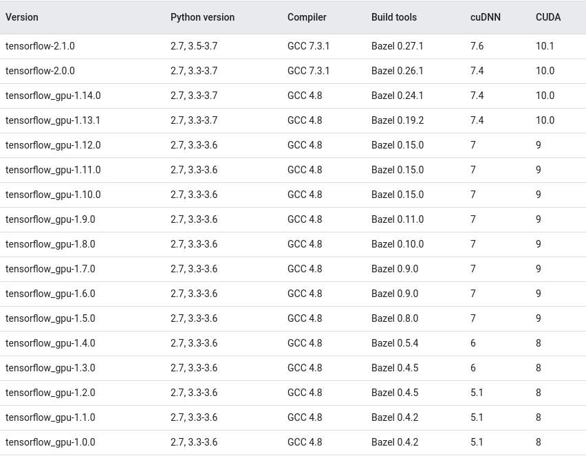

# Nvidia-Graphics-Driver-CUDA-&-CUDNN-Installation
It's a must installation after a fresh Ubuntu 18.04 OS installation.
## OS Installation Guideline:
- Download Ubuntu 18.04 OS image from this website: https://ubuntu.com/download/desktop
- Download Balena-Etcher from this website: https://www.balena.io/etcher/
- Follow this tutorial for installing Ubuntu 18.04 LTS OS on your system: https://www.youtube.com/watch?v=G6LAIrGeIjo
## Checking OS, Kernel & Driver Version:
Open a terminal with 'shift+ctrl+t' & check you have installed a supported version of ubuntu. Type: 
```
uname -m && cat /etc/*release
```
It should show: Ubuntu 18.04.4 or something similar. Check your GPU can deal with CUDA by running:
```
lspci | grep -i nvidia
```
It should show: VGA compatible controller NVIDIA GeForce GTX 1070 or something alike. Check your kernel headers are compatible with CUDA. Type:
```
uname -r
```
It should show: 5.3.0-46-generic or something similar. Install the kernel headers & packages with the following command:
```
sudo apt-get install linux-headers-$(uname -r)
```
## Configuring Latest Python Version:

It's always good practise to update & upgrade your pc before starting any type of installation. Run in a terminal:
```
sudo apt-get update
sudo apt-get upgrade
```
### Initial Check:
Ubuntu 18.04 LTS comes with preinstalled python 3. To check, run on terminal:
```
python3 --version
```
It should show: 3.6.9 or something similar.
### Create Symbolic Link for Python 3: 
To remove python 2.7, make python 3.6.9 default & import it with just "python" command, run on terminal:
```
sudo rm /usr/bin/python
sudo ln -s /usr/bin/python3 /usr/bin/python
```
### Check Installation:
Check with the following command: 
```
python --version
```
It should show: 3.6.9. Install same version shown in this tutorial to avoid additional problem.
### Note (Aditional Info): 
- If you install python2 anytime after creating the symlink, the symlink will automatically be removed by your system & the system will start to import python2 when called as 'python'.  
- Don't try to undo python symbolic link step by reversing the order, otherwise the system will break & you will loose your terminal. 
- If you want to unlink the symbolic link we created, type:
```
sudo rm /usr/bin/python
sudo ln -s /usr/bin/python2 /usr/bin/python
```
## Configuring Latest PIP Version:
### Initial Check:
If you want to use pip3 (python installation pipeline), first, check that your system has pip3 already installed by typing:
```
pip3 ---version
```
It should show: pip3 is not installed but can be insalled with 'sudo apt install python3-pip'.
### Binary Installation (Recommended):
You can install pip with python 3. Run in a terminal:
```
sudo apt install python3-pip
```
To verify successful pip3 installation, run: 
```
pip3 --version
```
It should show: pip 9.0.1 or something similar. You need to upgrade pip3 to install tensorflow 1.15 later. Run: 
```
pip3 install --upgrade pip
``` 
### Binary Installation (Applicable if you didn't use 1st Method):
You can also install pip in the following way:
```
wget https://bootstrap.pypa.io/get-pip.py
sudo python3 get-pip.py
```
### Create Symbolic Link for PIP 3:
If you want to remove pip2 (old version, comes with python 2.7), make pip3 as default & import pip3 as pip, run the following command:
```
sudo rm /usr/bin/pip
sudo ln -s /usr/bin/pip3 /usr/bin/pip
```
### Check Installation:
Now check successful pip3 installation & upgrade with the following command: 
```
python3 -m pip --version
```
It should show: pip 20.0.2 or something similar. Install same version shown in this tutorial to avoid additional problem.
### Note (Aditional Info): 
- pip or Python Installation Pipeline is a de facto standard package-management system used to install and manage software packages written in Python. Many packages can be found in the default source for packages and their dependencies — Python Package Index (PyPI).
- If you install pip with python2 anytime after creating the symlink, the symlink will automatically be removed by your system & the system will start to import pip2 when called as 'pip'.
- Don't try to undo pip symbolic link step by reversing the order, otherwise the system will break & you can seriously damage your system. 
- If you want to unlink the symbolic link we created, type:
```
sudo rm /usr/bin/pip
sudo apt install python-pip   # Only if you want to use pip with python2, otherwise don't run it
```
- pip or python -m pip commands do the same. The docs for distributing Python modules were just updated to suggest using python -m pip instead of the pip executable, because it's easier to tell which version of python is going to be used to actually run pip that way.
## Configuring GCC, G++ & Make:
### Initial Check:
To check that whether you have gcc, g++ & make already installed in your system or not, run:  
```
gcc --version
```
It should show: 'gcc' not installed or no such file or directory named 'gcc'.
### Binary Installation (Recommended):
To install GCC, G++ & Make, run the following command in a terminal:
```
sudo apt install build-essential
```
### Binary Installation (Applicable if you didn't use 1st Method):
If you want updated version of gcc & g++ to be installed on your system, run:
```
sudo apt install software-properties-common
sudo add-apt-repository ppa:ubuntu-toolchain-r/test
sudo apt install gcc-9 g++-9
```
Also if you want to make newly installed gcc your systems default gcc compiler, then run:
```
sudo update-alternatives --install /usr/bin/gcc gcc /usr/bin/gcc-9 90 --slave /usr/bin/g++ g++ /usr/bin/g++-9 --slave /usr/bin/gcov gcov /usr/bin/gcov-9
```
To check the updated version, run the following command in the terminal:
```
gcc --version
```
It should show: 9.1.0 or something similar.
### Check Installation:
To validate that the GCC compiler is successfully installed, run:
```
gcc --version
g++ --version
```
It should show: 7.5.0 or something similar. Install same version shown in this tutorial to avoid additional problem.
### Note (Aditional Info):
- If you want to know about different types of build systems, follow the link: http://wiki.ros.org/catkin/conceptual_overview#What_is_a_Build_System.3F?
- GNU compiler collection (GCC) is a collection of compilers for programming such as C++, C, Objective-C, Java, and Fortran. The GNU provide the optimising compiler for C++ which is known as g++. GCC release is from a free software foundation operated through the command line. 
- g++ compiler builds the object code from source code, and it does not generate any intermediate C version of the program. g++ is a complete compiler, but GCC requires the help of g++. 
- 'make' is a tool to help build programs. It introduces a separate file of "rules", that describes how to go from source code to finished program. It then interprets this file, figures out what needs to be compiled, and calls gcc for you. 
- For more info, visit: https://linuxize.com/post/how-to-install-gcc-compiler-on-ubuntu-18-04/. 
## Configuring Latest CMake Version:
### Initial Check:
Ubuntu 18.04 LTS doesn't come with a preinstalled cmake. To check, run on terminal:
```
cmake --version
```
It should show: Not installed but can be installed with 'sudo apt-get install cmake'. 
### GUI based Installation (Recommended):
Updated version of cmake (cmake-3.17.1) can also be installed using "snap" package manager. Just type in a terminal:
```
sudo snap install cmake
```
You can also install cmake from "Ubuntu software centre". Just type Cmake and click on 'install' when you get it.
### Binary Installation (Applicable if you didn't use GUI Method):
Here, we will download & install binary package in our system. Run the following command in the terminal:
```
sudo mkdir /opt/cmake
```
Manually download "cmake-3.17.1-Linux-x86_64.sh" file to the "Downloads" directory from this site: https://cmake.org/download/. Run the following command to copy the file to newly created cmake directory: 
```
sudo cp ~/Downloads/cmake-3.17.1-Linux-x86_64.sh /opt/cmake/
```
Now run the following command to install 'cmake':
```
cd /opt/cmake
sudo sh cmake-3.17.1-Linux-x86_64.sh --prefix=/opt/cmake --skip-license
```
In order to import current version of cmake with 'cmake' command, we will use symbolic link. Type:
```
cd ~
sudo ln -s /opt/cmake/bin/cmake /usr/local/bin/cmake
```
### Check Installation:
Check cmake installation with the following command: 
```
cmake --version
```
It should show: 3.17.1 or something similar. Install same version shown in this tutorial to avoid additional problem.
### Note (Aditional Info):
- 'sh' is a shell for running commands, so executing sh with sudo prompts you to a root shell. This means all commands in that shell are executed as root. Interactive shell helps you decide which things to install & which things to not as root.
- Snappy (snap) is a software deployment and package management system developed by Canonical for the Linux operating system. The packages, called snaps, and the tool for using them, snapd, work across a range of Linux distributions allowing distribution-agnostic upstream software packaging.
- Make sure you have installed latest version of cmake as many softwares use latest cmake version to build & test their up to date projects. 
- 'sudo apt-get install cmake' command will install older version of cmake (cmake-3.10.0). So, it is not recommended to use this command. 
- We have used precompiled binary package of cmake. You can also install cmake from source. To do so, follow the instruction here: https://vitux.com/how-to-install-cmake-on-ubuntu-18-04/
## Configuring Latest Nvidia Graphics Driver:
A list of Nvidia Graphics Driver with supported compute architecture is given below:
<p align="center">
    
</p>

### Initial Check:
Ensure that your pc has GPU from Nvidia:
```
ubuntu-drivers devices
```
Device drivers will be shortlisted & you can see nvidia drivers enlisted. We will choose Nvidia Driver-440 as 440 is comaptible with cuda-10.2 & ZED SDK-3.1.2 has support for cuda-10.2. (Also cuda-10.0 but not for cuda-10.1)
### Binary Installation (Recommended):
Install updated version of nvidia gpu driver by checking versions of drivers available on apt (Advanced Package Tool) & add drivers to ppa (Personal Package Archives). Run:
```
sudo apt-add-repository ppa:graphics-drivers/ppa
sudo apt-get update
sudo apt search nvidia-driver
sudo apt-get install nvidia-driver-440
```
### GUI based Installation (Applicable if you didn't use Binary Installation Method):
Go to Activities Overview--->Software Updater--->Settings--->Additional Driver & Choose available latest nvidia driver-440. Then click on "Apply changes".
### Check Installation:
Restart the computer. It is necessary to apply the changes installed in your system. Check the version of the nvidia graphics driver recently installed:
```
nvidia-smi
```
It should show: driver version-440.82 & CUDA version-10.2 or something similar. Install same version shown in this tutorial to avoid additional problem.
### Note (Aditional Info):
- If you upgrade or downgrade from a previous nvidia graphics driver, your previous graphics driver's kernel may sometime crash & your system may want to send this crash reports to the developers. It may pop up anytime: 'system program problem detected'. To prevent this error message from repeating, just open a terminal & do the followings :
```
ls -l /var/crash/
sudo rm /var/crash/*
```
- Ubuntu software centre method is just a user interface equivalent of the apt-get install commands except paid apps and some of the free apps which is submited through my apps portal are not available in apt-get.
- It's recommended to use PPA to add repositories for Nvidia drivers. Personal Package Archives (PPA) enables you to upload Ubuntu source packages to be built and published as an apt repository by Launchpad.
- It's recommended to use apt to install nvidia drivers. APT or Advanced Package Tool, is a free-software user interface that works with core libraries to handle the installation and removal of software on Debian, Ubuntu.
- If you want to download & install nvidia driver from source (it's not a recommended process), follow instructions in the website: http://www.linuxandubuntu.com/home/how-to-install-latest-nvidia-drivers-in-linux
## Configuring Latest CUDA installation:
A list of Nvidia Graphics Driver with supported cuda version is given below:
<p align="center">
    
</p>

### Initial Check:
Check whether cuda is already installed on your system or not. In the terminal, run:
```
nvcc --version
```
It should show: nvcc not installed but can be installed by 'sudo apt install nvidia-cuda-toolkit'. 
### Binary Installation:
Download cuda 10.2 from this website: https://developer.nvidia.com/cuda-downloads. Click on Linux---> x86_64---> Ubuntu---> 18.04---> runfile (local), you will get the installation method which is also mentioned below. Run the following commands in the terminal:
```
wget http://developer.download.nvidia.com/compute/cuda/10.2/Prod/local_installers/cuda_10.2.89_440.33.01_linux.run
sudo sh cuda_10.2.89_440.33.01_linux.run
```
When prompted to an interactive shell within the terminal, select 'continue' to continue without nvidia driver installation, as we have already installed it manually & type 'accept' for license agreement. Then on the next screen, just uncheck the driver installation option (untick 'x' in the box [ ] by pressing 'enter' key) & after that select the last option 'install'. It's ok to get error regarding incomplete driver installation on the terminal.
### Post Installation:
Just add 2 lines to your .bashrc file & save it. The .bashrc file is a hidden file & it is in the home directory. Press 'ctrl+h' to find it.
```
export PATH=/usr/local/cuda-10.2/bin${PATH:+:${PATH}}
export LD_LIBRARY_PATH=/usr/local/cuda-10.2/lib64${LD_LIBRARY_PATH:+:${LD_LIBRARY_PATH}}
```
### Check Installation:
To check the installation, open a new terminal & run:
```
sudo ldconfig
nvcc --version
``` 
You should not get any error & nvcc should show cuda version 10.2.89 or something similar.
### Note (Aditional Info):
- It's recommended to install Nvidia graphics driver along with cuda installation rather than manually as shown previously if you are a beginner. During graphics driver installation with CUDA, OpenGL related driver files are installed, nvidia drm kernel modules are installed, system x config files are updated to use the new nvidia driver & kernel source files are by default copied to /usr/src/nvidia-440.82/nvidia-drm.
- It's necessary to double check Nvidia Graphics driver supported cuda version. Otherwise, we won't be able to use matching version of tensorflow later in this tutorial.  
- You can manually follow the instruction to download and install cuda on your system. Go to this link for more info: https://developer.nvidia.com/cuda-downloads .
- You can get documentation of post installation instruction here: https://docs.nvidia.com/cuda/cuda-installation-guide-linux/index.html#post-installation-actions.
- $PATH or system path variable specifies the directories in which executable programs are located on the machine that can be started without knowing and typing the whole path to the file on the command line. On Linux and Mac OS X, it usually holds all bin and sbin directories relevant for the current user. On Windows, it contains at least the C:\Windows and C:\Windows\system32 directories.
- Environment variables hold values related to the current environment, like the Operating System or user sessions. For more info, visit the website: https://superuser.com/questions/284342/what-are-path-and-other-environment-variables-and-how-can-i-set-or-use-them.
- ${PATH:+:${PATH}} simply prepends newly specified path to the already existing system path when defined properly. For more info, visit this website: https://unix.stackexchange.com/questions/267506/what-does-pathpath-mean.
- $LD_LIBRARY_PATH points to the directory where cuda & cudnn dynamic link libraries (dll) are loaded. These libraries are necessary while running tensorflow in order to use your GPU. 
## Configuring Latest CUDNN installation:
### Initial Check:
First check that you have already cudnn installed on your system or not. Run:
```
cat /usr/local/cuda/include/cudnn.h | grep CUDNN_MAJOR -A 2
```
Or,
```
cat /usr/include/cudnn.h | grep CUDNN_MAJOR -A 2
```
It should show: No such file or directory. 
### Binary Installation:
Go to this website: https://developer.nvidia.com/rdp/cudnn-download & download "cuDNN Library for Linux". Put the file to your home directory after download. Now open a new terminal to copy the files & change their permission:
 ```
 tar -xzvf cudnn-10.2-linux-x64-v7.6.5.32.tgz
 sudo cp cuda/include/cudnn.h /usr/local/cuda/include
 sudo cp cuda/lib64/libcudnn* /usr/local/cuda/lib64
 sudo chmod a+r /usr/local/cuda/include/cudnn.h /usr/local/cuda/lib64/libcudnn*
 ```
 Now, navigate to the cuda library directory to see the symlinks. Run the following command: 
 ```
 cd /usr/local/cuda/lib64/
 ls -lha libcudnn*
 ```
You can see libcudnn.so and libcudnn.so.7 are not symlinks (i.e hard links) :
 ```
 /usr/local/cuda/lib64$ ls -lha libcudnn*
lrwxrwxrwx 1 root root  13 Mar 25 23:56 libcudnn.so 
lrwxrwxrwx 1 root root  17 Mar 25 23:55 libcudnn.so.7
-rwxr-xr-x 1 root root 76M Mar 25 23:27 libcudnn.so.7.6.5
```
Cudnn downloaded from nvidia has symbolic link but when copied to other location, it losses the symlink info. If so, stay in the same directory & terminal. Run the following command:
```
sudo rm libcudnn.so
sudo rm libcudnn.so.7
sudo ln -sf libcudnn.so.7.6.5 libcudnn.so.7
sudo ln -sf libcudnn.so.7 libcudnn.so
```
Now, type the following command to ensure that the symlinks have been created successfully:
```
 /usr/local/cuda/lib64$ ls -lha libcudnn*
lrwxrwxrwx 1 root root  13 Mar 25 23:56 libcudnn.so ---> libcudnn.so.7
lrwxrwxrwx 1 root root  17 Mar 25 23:55 libcudnn.so.7 ---> libcudnn.so.7.6.5
-rwxr-xr-x 1 root root 76M Mar 25 23:27 libcudnn.so.7.6.5
```
Then check whether the dlls can be accessed from the terminal or not. In the same terminal, run: 
```
sudo ldconfig
cd ~
```
You should not get any error.
### Check Installation:
To check the installation, run the following command:
```
cat /usr/local/cuda/include/cudnn.h | grep CUDNN_MAJOR -A 2
```
It should show: #define CUDNN_MAJOR 7 #define CUDNN_MINOR 6 #define CUDNN_PATCHLEVEL 5.    
### Note (Aditional Info):
- If you want to manually download & install cudnn in your system, follow the installation guideline documented on this website: https://docs.nvidia.com/deeplearning/sdk/cudnn-install/index.html .
- It is necessary to add -sf flag above for creating a symbolic link. If you forget to add it, it becomes a hard link. 
- 'sudo ldconfig' creates the necessary links and cache to the most recent shared libraries found in the directories specified on the command line or mentioned in the system path. The cache is used by the run-time linker.
## Configuring TensorRT installation:
### Initial Check:
If you have installed TensorRT through dpkg previously, then you can check the installation with the following command. Otherwise, there is no definitive way to check previous installation. Run in a terminal:
```
dpkg -l | grep TensorRT
```
It should show: No such file or directory. 
### Binary Installation:
Go to this website: https://developer.nvidia.com/nvidia-tensorrt-7x-download & download "Tar File Install Packages For Linux x86". Put the file to your home directory after download. Now open a new terminal to extract TensorRT from tar file:
 ```
 tar -xzvf TensorRT-7.0.0.11.Ubuntu-18.04.x86_64-gnu.cuda-10.2.cudnn7.6.tar.gz
 cd ~/TensorRT-7.0.0.11/
 ```
 Now install TensorRT from wheel files to use python examples. Execute the following commands one by one:
 ```
 cd python 
 sudo -H python3 -m pip install tensorrt-7.0.0.11-cp36-none-linux_x86_64.whl
 cd ..
 cd uff
 sudo -H python3 -m pip install uff-0.6.5-py2.py3-none-any.whl
 cd ..
 cd graphsurgeon
 sudo -H python3 -m pip install graphsurgeon-0.4.1-py2.py3-none-any.whl
 cd ~
 ```
 Now, navigate to the tensorrt library directory to see the symlinks. Run the following command: 
 ```
 cd ~/TensorRT-7.0.0.11/lib
 ls -lha libnvinfer*
 ```
You can see libnvinfer.so, libnvinfer.so.7, libnvinfer_plugin.so & libnvinfer_plugin.so.7 are symlinks. Then check whether the link directories have been successfully configured & updated in the cache from the terminal or not. In the same terminal, run: 
```
sudo ldconfig
cd ~
```
You should not get any error.
### Post Installation:
Just prepend ~/TensorRT-7.0.0.11/lib directory to system dynamic link libraries path list. Don't forget to save the file.
```
export PATH=/usr/local/cuda-10.2/bin${PATH:+:${PATH}}
export LD_LIBRARY_PATH=~/TensorRT-7.0.0.11/lib:/usr/local/cuda-10.2/lib64${LD_LIBRARY_PATH:+:${LD_LIBRARY_PATH}}
```
### Check Installation:
Manually check that the python samples are in the samples/python directory. To check the installation with terminal, install tree & check with 'tree' in a new terminal:
```
sudo snap install tree
cd TensorRT-7.0.0.11
tree -d
```
It should show whether all supported installed files are in place in the lib, include, data, etc… directories.
### Note (Additional Info):
- Installing from dpkg or debian installation method may limit you to single installation of TensorRT whereas installing from tar file helps you to do a lot of customization & also gives you freedom to install multiple versions of TensorRT in the same pc. 
- Don't append (just prepend) ~/TensorRT-7.0.0.11/lib directory after /usr/local/cuda-10.2/lib64 directory as the system tries to import dlls from cuda directory first rather than tensorrt & throws an error showing can not open shared libraries. 
- Build and run one of the shipped samples, for example, sampleMNIST in the installed directory. You should be able to compile and execute the sample without additional settings. For more information, visit: https://github.com/NVIDIA/TensorRT/tree/release/7.0/samples/opensource/sampleMNIST
- You can also check your installation if you have installed TensorRT using 'dpkg' command:
```
dpkg -l | grep TensorRT
```
It should show: libnvinfer7 7.0.0.11–1+cuda10.2 amd64 TensorRT runtime libraries & tensorrt 7.0.0.11–1+cuda10.2 amd64 Meta package of TensorRT.
# Open-CV-Tensorflow-and-Object-Detection-API-installation-with-Nvidia-GPU
It's an installation instruction for Opencv, Tensorflow & Object Detection API. Follow the guideline carefully for source installation. 
## Open CV installation:
### Initial Check:
First check that you have already opencv installed on your system or not. Run:
```
python3
>>>import cv2
```
It should show: Module_Not_Found_Error, No module named 'cv2'.
### Source Installation:
Source installation of opencv module requires quite a number of preinstalled programs to compile different libraries of opencv from source. Install developer tools by running the following command:
```
sudo apt-get install unzip pkg-config           # add `cmake` & `build-essential` if you haven't installed them previously.
```
OpenGL should have already been installed during Nvidia manual driver installation or Driver installation during CUDA installation. If not, install it by typing following command:
```
sudo apt-get install libglu1-mesa-dev freeglut3-dev mesa-common-dev mesa-utils
```
Check whether OpenGL is successfully installed or not by running:
```
glxinfo | grep "OpenGL version"
```
It should show: OpenGL version string: 4.6.0 NVIDIA 440.82 or something similar.
Now, we need to install some OpenCV-specific prerequisites & packages to work with your camera stream and process video files. Run the following commands:
```
sudo apt-get install libjpeg-dev libpng-dev libtiff-dev
sudo apt-get install libavcodec-dev libavformat-dev libswscale-dev libv4l-dev
sudo apt-get install libxvidcore-dev libx264-dev
sudo add-apt-repository "deb http://security.ubuntu.com/ubuntu xenial-security main"
sudo apt update
sudo apt install libjasper1 libjasper-dev
```
OpenCV’s highgui module relies on the GTK library for GUI operations. At the same time, install some packages which will provide optimizing functions for OpenCV & Python3 headers & libraries. Type:
```
sudo apt-get install libgtk-3-dev
sudo apt-get install libatlas-base-dev gfortran
sudo apt-get install python3-dev
sudo apt install python3-testresources
```
Since we’re continuing to work in the terminal, let’s download the official OpenCV release followed by the opencv_contrib  module using wget :
```
cd ~
wget -O opencv.zip https://github.com/opencv/opencv/archive/3.4.8.zip
wget -O opencv_contrib.zip https://github.com/opencv/opencv_contrib/archive/3.4.8.zip
```
Unzip & rename the directories. Run:
```
unzip opencv.zip
unzip opencv_contrib.zip
mv opencv-3.4.8 opencv
mv opencv_contrib-3.4.8 opencv_contrib
```
Let's configure & create Makefile for opencv using cmake by running:
```
cd ~/opencv
mkdir build
cd build
cmake -D CMAKE_BUILD_TYPE=RELEASE \
    -D ENABLE_CXX11=ON
    -D CMAKE_INSTALL_PREFIX=/usr/local \
    -D INSTALL_C_EXAMPLES=OFF \
    -D INSTALL_PYTHON_EXAMPLES=ON \
    -D WITH_CUDA=OFF \
    -D OPENCV_EXTRA_MODULES_PATH=~/opencv_contrib/modules \
    -D OPENCV_ENABLE_NONFREE=ON \
    -D BUILD_EXAMPLES=ON ..
```
Compile & install opencv by running the following command. 
```
nproc                                # Will give you the number of CPU cores
make -j8                             # Use -j4 instead if your CPU has 4 cores.
sudo make install
sudo ldconfig
cd ~
```
### Check Installation:
To check successful opencv installation, type:
```
python3
>>> import cv2
>>> cv2.__version__
'3.4.8'                              # Showing version of opencv installed on your system
>>> exit()
```
Change your directory where your Python 3 bindings for OpenCV resides & rename the binding file by running the following command:
```
cd /usr/local/lib/python3.6/dist-packages/cv2/python-3.6
sudo mv cv2.cpython-36m-x86_64-linux-gnu.so cv2.so
cd ~
```
### Note (Aditional Info):
- Follow the instruction on this site to download and install opencv & some other necessary packages manually: https://www.pyimagesearch.com/2018/05/28/ubuntu-18-04-how-to-install-opencv/ & follow this for opencv installation with advanced features on: https://gist.github.com/ArghyaChatterjee/fe55b35cf06110d1ddb9ab7d321592bc.
- If you want to test opengl, go to this website: http://www.codebind.com/linux-tutorials/install-opengl-ubuntu-linux/ & follow the instructions accordingly.
- 'cmake' & autotools are 2 different build systems. If you have source code build with autotools, you use './configure' & if you have cmake, you use 'cmake', 'ccmake' or 'cmake-gui' to do the configuration.
- 'cmake' command with Release flag creates a Makefile in the build directory following updated packages mentioned in requirement.txt file according to system configuration.
- 'make' command builds the package & compiles source codes of Makefile accordingly to create binary executable files. 
- 'sudo make install' command copies the compiled binaries to the system path binary directories accordingly.
- 'sudo ldconfig' creates the necessary links and cache to the most recent shared libraries found in the directories specified on the command line or mentioned in the system path. The cache is used by the run-time linker.
- ROS has a similar build system named 'catkin' which is based on cmake. For further information regarding different commands, you can see: http://wiki.ros.org/catkin/workspaces
## Tensorflow GPU installation:
After installing opencv, you should start installing tensorflow. A list of CUDA version compatible tensorflow is given below:
<p align="center">
    
</p>

Here, we will be installing tensorflow from binary packages. According to the chart above, tensorflow 1.15 binary package ships with preconfigured cuda 10.2. <br>
Assuming that you have a nvidia compatible gpu, run in the terminal:
```
python3 -m pip install --user tensorflow-gpu==1.15
```
To check the successful gpu version installation, type:
```
python3
import tensorflow as tf
tf.test.is_gpu_available()
exit()
``` 
If you are getting errors like 'can not open shared libraries: No such files or directory', most probably your system is having updated version of some cuda dynamic link libraries which doesn't ship with pre-compiled tensorflow 1.15 binaries which we just installed. To avoid this error, do the following steps:
```
sudo cp /usr/lib/x86_64-linux-gnu/libcublas.so.10.2.2.89 /usr/local/cuda-10.2/targets/x86_64-linux/lib/
sudo cp /usr/lib/x86_64-linux-gnu/libcublas_static.a /usr/local/cuda-10.2/targets/x86_64-linux/lib/
sudo cp /usr/include/cublas.h /usr/local/cuda-10.2/targets/x86_64-linux/include/
```
After you copied some dlls from system library directory to the directory where your cuda libraries are installed, make symlinks of those dlls so that the tensorflow 1.15 can access familiar version of dlls (version 10.0) during GPU enhanced computations. In the same terminal, type:
```
cd /usr/local/cuda/lib64
sudo ln -sf libcudart.so.10.2.89 libcudart.so.10.0
sudo ln -sf libcublas.so.10.2.2.89 libcublas.so.10.0
sudo ln -sf libcufft.so.10.1.2.89 libcufft.so.10.0
sudo ln -sf libcurand.so.10.1.2.89 libcurand.so.10.0
sudo ln -sf libcusolver.so.10.3.0.89 libcusolver.so.10.0
sudo ln -sf libcusparse.so.10.3.1.89 libcusparse.so.10.0
```
To know the version & directory where tensorflow is located, run:
```
cd ~
pip3 show tensorflow-gpu
```
It should show version & location of tensorflow installed on your system. 
### Note (Aditional Info): 
- Tensorflow Object Detection Module supports Tensorflow 1.x till this date. So, it's better to install tensorflow 1.x version if you want to use tensorflow for object detection. If you want to convert a file from tensorflow 1.x to 2.x compatible all by yourself, go through this tutorial: https://www.tensorflow.org/guide/migrate.   
- To this date, tensorflow 1.15 binary package works well with cuda 10.0 (Not cuda 10.2). So if you want to run with cuda 10.2, you can also build tensorflow 1.15 from source. Follow this instruction: https://www.tensorflow.org/install/source.
- As we have already upgraded the pip3 version (v. 20.0.2), the default version of tensorflow which will be installed is tensorflow 2.1. With the same command, the previous version of pip3 (v. 9.0.1) would have installed tensorflow 1.14. 
- From tensorflow 2.x versions, you do not need to explicitely mention the gpu or cpu version, only mentioning "tensorflow" will do the same job. 
- If you are using a virtual environment, omit the --user argument. 
- Upgrading the system pip can cause problems. If not in a virtual environment, use python3 -m pip. This ensures that you upgrade and use the Python pip instead of the system pip. 
- If you ever realize that you have installed wrong version of tensorflow, then you can do the following to get it undone & after that, manually delete files named 'tensorflow-estimator-1.15', 'tensorflow-estimator', 'tensorflow', 'tensorboard-1.15', 'tensorboard' from usr/arghya/.local/lib/python3.6/site-packages/.
```
python3 -m pip uninstall tensorflow-gpu
```
## Tensorflow Object Detection API Installation:
In a new terminal, run the following command:
```
sudo apt install git
```
Now, we have to download "models" repository from tensorflow github page: https://github.com/tensorflow/models & put that inside default tensorflow installed directory. To do so, run in the terminal:
```
cd ~/.local/lib/python3.6/site-packages/tensorflow
git clone https://github.com/tensorflow/models
cd ~
```
Some tensorflow binary files are located inside ~/.local/bin directory. Open the .bashrc file in your home directory. The PATH should look something like this:
```
export PATH=/usr/local/cuda-10.2/bin${PATH:+:${PATH}}
```
You have to manually add ~/.local/bin directory to environment path variable. After adding the directory to the path variable list, it should look something like this:
```
export PATH=/usr/local/cuda-10.2/bin:~/.local/bin${PATH:+:${PATH}}
``` 
To verify the path, open a new terminal & run: 
```
echo $PATH
```
The path should show something like this:
```
/usr/local/cuda-10.2/bin:~/.local/bin:/usr/local/sbin:/usr/local/bin:/usr/sbin:/usr/bin:/sbin:/bin:/usr/games:/usr/local/games:/snap/bin
```
The remaining libraries can be installed on Ubuntu 18.04 via apt:
```
sudo apt-get install protobuf-compiler python3-pil python3-lxml python3-tk      
python3 -m pip install --user numpy
python3 -m pip install --user Cython
python3 -m pip install --user contextlib2
python3 -m pip install --user jupyter
python3 -m pip install --user matplotlib
```
Now, download, compile & copy the cocoapi files to the tensorflow default installed directory. 
```
git clone https://github.com/cocodataset/cocoapi.git
cd cocoapi/PythonAPI
make
cp -r pycocotools ~/.local/lib/python3.6/site-packages/tensorflow/models/research/
cd ~
```
The Tensorflow Object Detection API uses Protobufs to configure model and training parameters. Before the framework can be used, the Protobuf libraries must be compiled. Run:
```
cd ~/.local/lib/python3.6/site-packages/tensorflow/models/research/
protoc object_detection/protos/*.proto --python_out=.
```
Make sure the directories have been added to the python path. Type in the same shell: <br>
```
export PYTHONPATH=$PYTHONPATH:`pwd`:`pwd`/slim
```
You can test that you have correctly installed the Tensorflow Object Detection API by running the following command. In the same terminal, run:
```
python3 object_detection/builders/model_builder_test.py
```
For permanent use, open your .bashrc file & put this line at the end:
```
export PYTHONPATH=$PYTHONPATH:/home/arghya/.local/lib/python3.6/site-packages/tensorflow/models:/home/arghya/.local/lib/python3.6/site-packages/tensorflow/models/research:/home/arghya/.local/lib/python3.6/site-packages/tensorflow/models/research/slim
```
Then, you have to open a new terminal & run the following command:
```
cd ~/.local/lib/python3.6/site-packages/tensorflow/models/research/
python3 object_detection/builders/model_builder_test.py
```
Or, you can source your currently modified .bashrc file & execute required command in the same terminal:
```
source ~/.bashrc               
python3 object_detection/builders/model_builder_test.py
```
Alternatively, you can terminate the current bash session & start a new session from the same terminal to execute required command:
```
exec bash                      
python3 object_detection/builders/model_builder_test.py
```
### Note (Aditional Info):
- It's always a good practice to visit the vendor's website (who actually built it) before starting the installation. Visit the website: https://www.stereolabs.com/docs/tensorflow/
- If you want, you can follow the tutorial & manually install tensorflow object detection api from the github page: https://github.com/tensorflow/models/blob/master/research/object_detection/g3doc/installation.md.
- In newer versions of tensorflow, protobuf compilers are installed during tensorflow installation. It's not needed to be installed separately. 
- coco-api installation can be difficult for some reasons. If you find it very hard, then you can skip the step.
- Executing a script will run the commands in a new shell process where as sourcing a script will run the commands in the current shell process. For more info, visit the website: https://superuser.com/questions/176783/what-is-the-difference-between-executing-a-bash-script-vs-sourcing-it.
- '.profile' is for things that are not specifically related to Bash, like environment variables PATH & friends, and should be available anytime, whereas '.bashrc' is for configuring the interactive bash usage, like bash aliases, setting your favorite editor, setting the Bash prompt, etc. 
- In case of '.bash_profile', it is for making sure that both the things in .profile and .bashrc are loaded for login shells. For more info, visit the website: https://serverfault.com/questions/261802/what-are-the-functional-differences-between-profile-bash-profile-and-bashrc#answer-500071.

# ZED-Camera-SDK-ZED-Python-API-Installation-and-Object-Detection-Demo
It's a repository to use ZED camera with ZED SDK &amp; ZED Python API for Object detection with Tensorflow.
## ZED Camera SDK Installation:
Download the Latest SDK version from the site: https://www.stereolabs.com/developers/release/.
The default download should be in your "Downloads" directory. To check, run in a terminal:
```
cd ~/Downloads
ls
```
You should see a file in the name of ZED_SDK_Ubuntu18_cuda10.2_v3.1.2.run or something similar. Now change the permission of the file so that you can execute it from the terminal.
```
chmod +x ZED_SDK_Ubuntu18_cuda10.2_v3.1.2.run
```
Now, the file is executable. Run the following command:
```
./ZED_SDK_Ubuntu18_cuda10.2_v3.1.2.run
```
Follow the instruction & the necessary files and libraries will automatically be installed in to the system. To check installation, run the following command:
```
cd /usr/local/zed/tools
ls
```
You should see some executables. Try to run them one by one. After starting an executable, to stop it, hit ctrl+c. Now run the following command:
```

./ZED_Explorer      # To start an example
ctrl+c              # To stop it
./ZED_Depth_Viewer  # To start another example
ctrl+c              # To stop it
./ZEDfu             # To start another example
ctrl+c              # To stop it
```
## ZED Python API Installation:
Run the following command before installing zed python api on your pc. Make sure that python3, pip & Open CV are already installed. 
```
cd ~
python3 -m pip install numpy pyopengl
```
Now move to zed sdk directory to download zed python api. Run the following command:
```
cd /usr/local/zed
python3 get_python_api.py
```
The system will automatically download a wheel file in the current directory. To install it, run:
```
python3 -m pip install pyzed-3.1-cp36-cp36m-linux_x86_64.whl
```
To check successful installation, run:
```
cd ~
python3
import pyzed.sl as sl
```
The file should successfully import without showing any error. 
### Note (Aditional Info):
- For manual installation, follow tutorial provided in their official website: https://www.stereolabs.com/docs/app-development/python/install/
- Follow tutorial from official website to install from binary package rather installing from source (hectic way). If you really want to install from source, follow their github page: https://github.com/stereolabs/zed-python-api
## Object Detection Model Run:
Download the "object_detection_zed.py" from this github repo: https://github.com/ArghyaChatterjee/Object-Detection-Demo-With-ZED-camera-on-Ubuntu-18.04/blob/master/object_detection_zed.py. <br> 
Just open a new file in your home directory with the name "object_detection_zed.py", paste the code & save the file. Then open a new terminal to copy the file from 'home' to 'object_detection' directory under tensorflow:
```
cp ~/object_detection_zed.py ~/.local/lib/python3.6/site-packages/tensorflow/models/research/object_detection/
```
Now in the same terminal, run 'object_detection_zed.py' using python3 to start object detection with ZED:
```
cd ~/.local/lib/python3.6/site-packages/tensorflow/models/research/object_detection/
python3 object_detection_zed.py
```
To monitor system performance during the task allocated, you can open Activities Overview--->System Monitor. Alternatively, you can also install 'htop' to monitor system parameters in a unique way. In a new terminal, run:
```
sudo snap install htop
htop
```
To monitor your nvidia gpu memory usage during a certain gpu intensive task, install 'glances' & check by running the following command in a new terminal:
```
sudo python3 -m pip install glances[gpu]
sudo glances
```
The result should be something like below:
<p align="center">
    
</p>

### Note (Aditional Info): 
- During running object_detection_zed.py with python3, if you see some error on the terminal mentioning 'can not open shared files', probably you are missing libcudart.so.10.0 & libnvinfer.so.6.0 dlls in /usr/local/cuda/lib64 directory. So, your system is using cpu instead of gpu during object detection. 
- This type of error occurs when tensorflow functions can not access to use cuda dynamic link libraries (dlls) of your system due to cuda version mismatch. Sometimes downgrading cuda version may solve the problem but it's a hectic thing.    
- You can also download the object_detection_zed code from this website: https://github.com/stereolabs/zed-tensorflow/blob/master/object_detection_zed.py. They are the key people who wrote it.
- If you want to import tensorflow from any directory, add the following line to the .bashrc file. For further info regarding $TENSORFLOWPATH, visit the website: https://stackoverflow.com/questions/33616732/where-is-the-folder-for-installing-tensorflow-with-pip-mac-osx
```
export $TENSORFLOW="~/.local/lib/python3.6/site-packages/tensorflow:$PATH"
```
# Special Thanks:
1. https://github.com/stereolabs/zed-tensorflow
2. https://www.stereolabs.com/docs/api/
